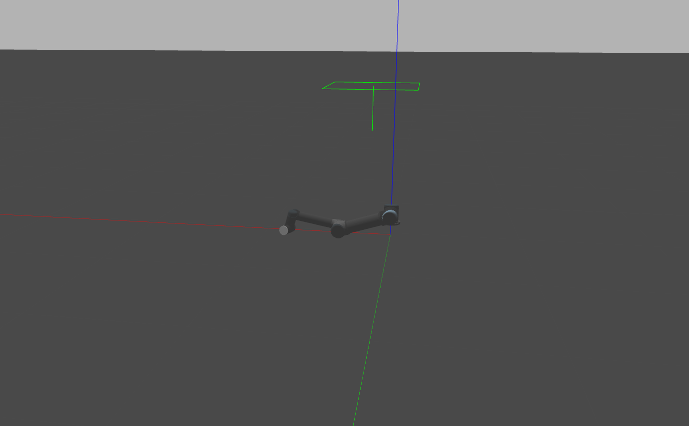

<p align="center">  
基于ur5机械臂的导纳控制
</p>

## 简介
基于ur5，末端添加力传感器实现力控。只实现对三自由度的力控。
参考连接：[Compliant-Control-and-Application](https://github.com/MingshanHe/Compliant-Control-and-Application.git "title")  
机械臂关节配置effort_controllers/JointPositionController，导纳控制计算机械臂末端目标三自由度位置，经过逆向运动学求解获得关节解，基于最小二乘法获取最优解，并向各个关节发送控制指令。

## 环境配置
1.ros noetic

## 编译
```
catkin_make -j1
```

## 使用说明
1.运行ur5机械臂的仿真环境
```
roslaunch ur_gazebo ur5_gazebo.launch transmission_hw_interface:=hardware_interface/EffortJointInterface
```
<p align="center">  
.
</p>
2.运行ur5机械臂的导纳控制节点

```
roslaunch ur5_control AdmittancePos.launch
```
3.运行控制指令发送节点
```
rosrun ur5_control ur5_control
```
选择2发布末端位置控制指令
推荐：
x:0.3 y:0.3 z:0.3
qw:0.707 qy:0 qz:0.707 qx:0


